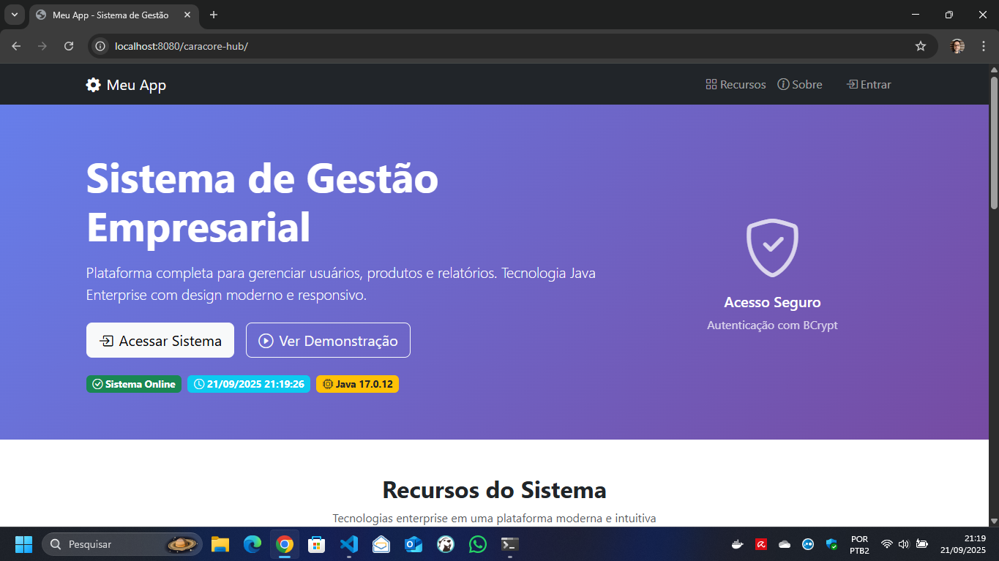

## caracore-hub — Jakarta EE (Tomcat / WildFly)


> _Capa do projeto — automação de build e deploy com foco em previsibilidade._

Aplicação Java (Jakarta EE) com autenticação, automação de build/deploy via Python e banco PostgreSQL (Docker). Este README foi atualizado para refletir o rename do projeto para "caracore-hub", o contexto padrão `/caracore-hub` e o fluxo E2E da opção 12.

### Destaques do projeto

- Workflows automatizados de build, deploy e diagnóstico unificados em `main.py`.
- Automação reproduzível com Python (venv) e provisionamento de banco usando Docker Compose.
- Deploy homologado em Tomcat 10.1.35 e WildFly 37.0.1.Final com validações de datasource.
- Testes fim a fim encapsulados (Opção 12) incluindo verificação de login via browser headless.

---

### Sumário

- [caracore-hub — Jakarta EE (Tomcat / WildFly)](#caracore-hub--jakarta-ee-tomcat--wildfly)
  - [Destaques do projeto](#destaques-do-projeto)
  - [Sumário](#sumário)
  - [Visão geral](#visão-geral)
  - [Sequência de scripts (recomendado)](#sequência-de-scripts-recomendado)
  - [Pré-requisitos](#pré-requisitos)
  - [Deploy](#deploy)
    - [Tomcat (via `main.py`, recomendado)](#tomcat-via-mainpy-recomendado)
    - [Tomcat (plugin Maven para desenvolvimento)](#tomcat-plugin-maven-para-desenvolvimento)
    - [WildFly](#wildfly)
  - [Datasource (PostgreSQL)](#datasource-postgresql)
    - [Origem padrão](#origem-padrão)
    - [Automação via menu (`main.py`)](#automação-via-menu-mainpy)
    - [Overrides temporários (PowerShell)](#overrides-temporários-powershell)
    - [Validação](#validação)
  - [Variáveis/argumentos úteis](#variáveisargumentos-úteis)
  - [Troubleshooting rápido](#troubleshooting-rápido)
    - [Portas 8080/9090 em uso](#portas-80809090-em-uso)
    - [Docker inativo](#docker-inativo)
    - [Compose v2](#compose-v2)
    - [Logs de aplicação](#logs-de-aplicação)
    - [Dependências JSTL](#dependências-jstl)
    - [Erro `ModuleNotFoundError: No module named 'requests'`](#erro-modulenotfounderror-no-module-named-requests)
  - [Estrutura (resumo)](#estrutura-resumo)
  - [Testar login (Tomcat e WildFly)](#testar-login-tomcat-e-wildfly)
    - [Pré-requisitos (login)](#pré-requisitos-login)
    - [Tomcat (porta 9090)](#tomcat-porta-9090)
    - [WildFly (porta 8080)](#wildfly-porta-8080)
    - [Se o login falhar](#se-o-login-falhar)
  - [Documentação essencial](#documentação-essencial)
  - [Documentação complementar](#documentação-complementar)

---

### Visão geral


> _Visão geral do fluxo: banco de dados, build, deploy e validação de login._

- Código da aplicação: `caracore-hub`
- Automação: `main.py` (menu + build/deploy/diagnóstico)
- Provisionamento Python: `setup-python.ps1` (venv + requirements)
- Validação ambiente dev: `setup.dev.py` (checagens e auto-fix opcionais)
- Banco de dados: `docker-compose.yml` + `docker/postgres/init/01-init.sql`
- Servidores suportados:
  - Tomcat 10.1.35 (HTTP 9090 quando standalone via `main.py`)
  - WildFly 37.0.1.Final (HTTP 8080, Management 9990)

---

### Sequência de scripts (recomendado)

1. `setup-python.ps1`: prepara o ambiente Python local (cria `venv` e instala `requirements.txt`).
2. `setup.dev.py`: valida configuração do ambiente de desenvolvimento (Java, Maven, Docker, PostgreSQL, bcrypt) e pode tentar corrigir.
3. `main.py`: menu para build, deploy e gestão dos servidores (Tomcat/WildFly).

---

### Pré-requisitos

| Componente | Requisito mínimo | Observações |
| --- | --- | --- |
| Java | JDK 11+ | Defina `JAVA_HOME` para evitar conflitos com Maven |
| Maven | 3.8+ | Necessário para o build multi-módulo |
| Python | 3.10+ | Requerido por `main.py` e `setup.dev.py` |
| Docker | Desktop + Compose v2 | Provisiona o PostgreSQL local |

> **Importante:** este repositório não versiona os binários dos servidores. Crie a pasta `server/` com Tomcat 10.1.35 e WildFly 37.0.1.Final ou aponte caminhos via variáveis/argumentos (`APP_TOMCAT_DIR`, `APP_WILDFLY_DIR`, `--tomcat-dir`, `--wildfly-dir`).

Teste rápido (PowerShell):

```powershell
java -version
mvn -version
python --version
docker --version
```

---

### Deploy

#### Tomcat (via `main.py`, recomendado)

- Empacota o WAR, ajusta `server.xml` para a porta 9090 e posiciona `caracore-hub.war` em `webapps/` do Tomcat standalone.
- Acesso: [http://localhost:9090/caracore-hub](http://localhost:9090/caracore-hub)


> _Aplicação publicada no Tomcat (porta 9090) com contexto ROOT._

#### Tomcat (plugin Maven para desenvolvimento)

```powershell
mvn -f .\caracore-hub\pom.xml tomcat10:run -DskipTests
```

- Porta padrão do plugin: 8080 → [http://localhost:8080/caracore-hub](http://localhost:8080/caracore-hub)

#### WildFly

- O WAR é enviado para `standalone/deployments` como `caracore-hub.war`.
- Acesso: [http://localhost:8080/caracore-hub](http://localhost:8080/caracore-hub)
- Console: [http://localhost:9990/](http://localhost:9990/)



> _Aplicação publicada no WildFly (porta 8080) com contexto ROOT._

As portas podem ser ajustadas no `main.py` (`TOMCAT_PORT`, `WILDFLY_PORT`) ou diretamente nos servidores.

---

### Datasource (PostgreSQL)

#### Origem padrão

- Credenciais e banco vêm de `docker-compose.yml` (serviço `postgres`).
- Valores padrão: DB `meu_app_db`, usuário `meu_app_user`, senha `meu_app_password`, host `localhost`, porta `5432`.
- Variáveis `APP_DB_HOST`, `APP_DB_PORT`, `APP_DB_NAME`, `APP_DB_USER`, `APP_DB_PASSWORD` substituem os valores do compose quando definidas.

#### Automação via menu (`main.py`)

- Opção 10: configura o datasource no WildFly (atualiza `standalone.xml` e cria o módulo JDBC).
- Opção 11: configura o datasource no Tomcat (ajusta `conf/context.xml` e adiciona o driver em `lib/`).
- Deploys das opções 2 (Tomcat) e 4 (WildFly) executam automaticamente essas etapas antes de publicar o WAR.

> **Atenção:** alterações em `conf/context.xml` e `standalone.xml` exigem reinício. O menu trata o restart de ambos os servidores.

#### Overrides temporários (PowerShell)

```powershell
$env:APP_DB_HOST = '127.0.0.1'
$env:APP_DB_PORT = '5433'
$env:APP_DB_NAME = 'meu_app_db'
$env:APP_DB_USER = 'meu_app_user'
$env:APP_DB_PASSWORD = 'meu_app_password'
python .\main.py
```

#### Validação

- `main.py` testa a conexão (se `psycopg2-binary` estiver instalado) com os mesmos parâmetros do deploy.
- Backups automáticos (`*.bak`) são criados antes de editar `context.xml` e `standalone.xml`.
- O driver JDBC PostgreSQL 42.7.4 é baixado sob demanda.

---

### Variáveis/argumentos úteis

- `APP_TOMCAT_DIR`: caminho do Tomcat.
- `APP_WILDFLY_DIR`: caminho do WildFly.
- `--tomcat-dir` / `--wildfly-dir`: overrides via CLI para o `main.py`.
- `--only-check`: executa somente validações e encerra.

---


### Troubleshooting rápido

#### Portas 8080/9090 em uso

```powershell
netstat -ano | findstr :8080
taskkill /F /PID <PID>
```

#### Docker inativo

Abra o Docker Desktop e reexecute as checagens.

#### Compose v2

Utilize `docker compose`, não `docker-compose`.

#### Logs de aplicação

- Tomcat: `server/apache-tomcat-*/logs/`
- WildFly: `server/wildfly-*/standalone/log/server.log`

#### Dependências JSTL

Mantenha os artefatos `jakarta.servlet.jsp.jstl-*` do `pom.xml`.

#### Erro `ModuleNotFoundError: No module named 'requests'`

- Execute dentro da venv ou ative-a:

  ```powershell
  . .\.venv\Scripts\Activate.ps1
  python .\main.py
  ```

- Rodar sem ativar a venv também funciona chamando o Python da própria venv:

  ```powershell
  .\.venv\Scripts\python.exe .\main.py --only-check
  .\.venv\Scripts\python.exe .\main.py
  ```

- Caso faltem pacotes, reinstale-os:

  ```powershell
  ./setup-python.ps1
  ```

- Teste rápido do pacote:

  ```powershell
  .\.venv\Scripts\python.exe -c "import requests; print(requests.__version__)"
  ```

Documentação de apoio: `doc/DEPLOY.md`, `doc/ARQUITETURA.md`, `doc/RESULTADOS-TESTES.md`.

---

### Estrutura (resumo)

```text
app_jakarta/
 |- main.py
 |- docker-compose.yml
 |- docker/
 |  \\- postgres/init/01-init.sql
 |- caracore-hub/
 |  |- pom.xml (parent multi-módulo)
 |  |- core/ (modelos, PdfService)
 |  |- persistence/ (DAO, JPA, serviços)
 |  |- api/ (JAX-RS)
 |  \\- web/ (WAR, servlets, JSP)
 |- server/ (gerado ao preparar Tomcat/WildFly standalone)
 \\- log/ (maven_deploy.log)
```

---

### Testar login (Tomcat e WildFly)

Os servidores ficam em `server/`. Use o passo a passo abaixo para validar autenticação após o deploy.

#### Pré-requisitos (login)

- PostgreSQL ativo: `docker compose up -d postgres`.
- Deploy executado via `python .\main.py` (opções 2, 4 ou 12).

#### Tomcat (porta 9090)

1. No menu, escolha o deploy no Tomcat (gera `ROOT.war` e reinicia se necessário).
2. Acesse [http://localhost:9090/caracore-hub](http://localhost:9090/caracore-hub).
3. Faça login com `admin@meuapp.com` ou `supervisor@meuapp.com` (senha `Admin@123`).

#### WildFly (porta 8080)

1. Configure o datasource (opção 10) e inicie o servidor (`main.py` ou `server/wildfly-*/bin/standalone.bat`).
2. Garanta o deploy (`main.py` opção 4) para publicar `caracore-hub.war` em `standalone/deployments`.
3. Acesse [http://localhost:8080/caracore-hub](http://localhost:8080/caracore-hub) com as mesmas credenciais.

#### Se o login falhar

- Verifique o banco e variáveis `APP_DB_*`.
- Consulte os logs (Tomcat `server/apache-tomcat-*/logs/`, WildFly `server/wildfly-*/standalone/log/server.log`).
- Reaplique o datasource e reinicie os servidores.

---

### Documentação essencial

- [Guia de deploy (passo a passo)](doc/DEPLOY.md)
- [Arquitetura e visão macro](doc/ARQUITETURA.md)
- [Comandos Maven usados no projeto](doc/MAVEN-COMANDOS.md)
- [Relatórios de testes automatizados](doc/RESULTADOS-TESTES.md)
- [Checklist de testes manuais e evidências](doc/TESTES-RELATORIO.md)
- [Execução local sem MCP/VS Code](doc/README_NO_MCP.md)

> Referência executiva: [doc/ARTICLE.md](doc/ARTICLE.md)

### Documentação complementar

- [Histórico de fases e pendências](doc/fases/)
- [Resumo de refatorações e decisões](doc/REFATORACAO.md)
- [Checklist de entrega](doc/checklist/checklist.md)
- Pastas de logs, seeds e init scripts descritas em [docker/postgres/init](docker/postgres/init/) e [logs/](logs/)


—
Última atualização: Campo Largo, sexta-feira, 17 de outubro de 2025.
