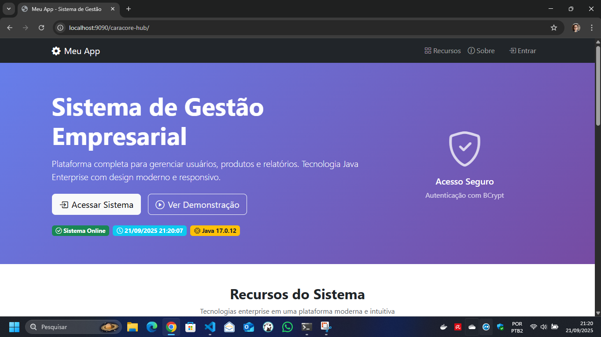

## Projeto Java Web (Tomcat / WildFly)


<sub><em>Capa do projeto — automação de build e deploy com foco em previsibilidade.</em></sub>

Aplicação Java (Jakarta EE) com autenticação, automação de build/deploy via Python e banco PostgreSQL (Docker). Este README foi reorganizado para apresentar os principais cenários com imagens reais do projeto e guiar você rapidamente à execução fim a fim.

—

### Visão geral

<sub><em>Visão geral do fluxo: banco de dados, build, deploy e validação de login.</em></sub>

- Código da aplicação: `meu-projeto-java`
- Automação: `main.py` (menu + build/deploy/diagnóstico)
- Provisionamento Python: `setup-python.ps1` (venv + requirements)
- Validação ambiente dev: `setup.dev.py` (checagens e auto-fix opcionais)
- Banco de dados: `docker-compose.yml` + `docker/postgres/init/01-init.sql`
- Servidores suportados:
  - Tomcat 10.1.35 (HTTP 9090 quando standalone via `main.py`)
  - WildFly 37.0.1.Final (HTTP 8080, Management 9990)

—

### Sequência de scripts (recomendado)
1. `setup-python.ps1`: prepara o ambiente Python local (cria `venv` e instala `requirements.txt`).
2. `setup.dev.py`: valida configuração do ambiente de desenvolvimento (Java, Maven, Docker, PostgreSQL, bcrypt) e pode tentar corrigir.
3. `main.py`: menu para build, deploy e gestão dos servidores (Tomcat/WildFly).

—

### Pré‑requisitos
- Java JDK 11+ (recomendado definir `JAVA_HOME`)
- Maven 3.8+
- Docker Desktop (Compose v2) para banco local
- Python 3.10+ (para `main.py` e `setup.dev.py`)

Observação importante sobre servidores (não versionados):
- Este repositório não inclui os binários dos servidores de aplicação.
- Prepare a pasta `server/` localmente com as versões específicas:
  - `server/apache-tomcat-10.1.35/` (Tomcat 10.1.35)
  - `server/wildfly-37.0.1.Final/` (WildFly 37.0.1.Final)
- Alternativa: aponte para instalações existentes usando variáveis de ambiente ou argumentos de CLI:
  - `APP_TOMCAT_DIR` e `APP_WILDFLY_DIR`
  - ou `--tomcat-dir` e `--wildfly-dir` ao chamar o `main.py`
  - Exemplo (PowerShell):
    ```powershell
    $env:APP_TOMCAT_DIR = 'C:\servers\apache-tomcat-10.1.35'
    $env:APP_WILDFLY_DIR = 'D:\servers\wildfly-37.0.1.Final'
    python .\main.py --only-check
    ```

Teste rápido (PowerShell):
```powershell
java -version
mvn -version
python --version
docker --version
```

—

### Setup rápido (Windows PowerShell)
1) Preparar o ambiente Python (cria venv e instala requirements):
```powershell
./setup-python.ps1
```
2) Ativar a venv (para rodar `setup.dev.py` e `main.py` no ambiente isolado):
```powershell
. .\.venv\Scripts\Activate.ps1
```
3) Validar a configuração do ambiente local (checagens e correções opcionais):
```powershell
python .\setup.dev.py --only-check   # Apenas checagens
python .\setup.dev.py --auto-fix     # (Opcional) tenta corrigir problemas
```
4) Subir o Postgres em Docker (se ainda não estiver rodando):
```powershell
docker compose up -d postgres
docker ps --filter "name=postgres"
```
5) Checagem final do projeto e/ou abrir o menu:
```powershell
python .\main.py --only-check
python .\main.py
```

—
### Execução (menu Python)
Abra o menu interativo e siga as opções de build/deploy/diagnóstico:
```powershell
python .\main.py
```

Overrides de diretório dos servidores (precedência: argumento > variável > padrão):
```powershell
$env:APP_TOMCAT_DIR='C:\servers\tomcat10'
$env:APP_WILDFLY_DIR='C:\servers\wildfly37'
python .\main.py

# ou via argumentos
python .\main.py --tomcat-dir C:\servers\tomcat10 --wildfly-dir D:\wildfly-37
```
Logs do orquestrador: `log/maven_deploy.log`.

—
### Execução fim a fim (Opção 12)
A opção 12 realiza um fluxo completo e não interativo:
- para Tomcat e WildFly (se estiverem rodando), garantindo estado limpo;
- sobe o PostgreSQL (Docker) e valida a conexão;
- garante a semente do usuário ADMIN com hash BCrypt $2a$ (compatível com jBCrypt);
- executa o build da aplicação (Maven);
- faz deploy no Tomcat (cold deploy) e no WildFly (hot deploy);
- valida JNDI/datasource por servidor (nomes distintos) e testa o login via browser headless.

Comando:
```powershell
python .\main.py 12
```

Padrões importantes:
- JNDI: Tomcat usa `java:comp/env/jdbc/PostgresDS`; WildFly usa `java:/jdbc/PostgresDS`.
- Contexto: o contexto padrão do WAR é `/meu-projeto-java`. Se o WAR for publicado como `ROOT.war`, o contexto será `/`.
- Portas: Tomcat 9090; WildFly 8080; WildFly management 9990.

—

### Banco de Dados
- Serviço: `postgres` em `docker-compose.yml`
- Inicialização: scripts em `docker/postgres/init/*.sql`
- Credenciais/DB padrão (compose): `meu_app_db` / `meu_app_user` / `meu_app_password`

Usuários padrão criados no primeiro start (hash BCrypt de `Admin@123`):
- admin@meuapp.com (ADMIN)
- admin@exemplo.com (ADMIN)
- joao@exemplo.com (USUARIO)
- maria@exemplo.com (USUARIO)

Validação do hash do admin (instala `bcrypt` se faltar):
```powershell
python .\setup.dev.py --auto-fix
```

—

### Build e testes (Maven)
```powershell
cd .\meu-projeto-java
mvn clean package -DskipTests
mvn clean test verify
```
Perfis disponíveis no `pom.xml`: `tomcat`, `wildfly`, `run`.
```powershell
mvn clean package -Ptomcat -DskipTests
mvn clean package -Pwildfly -DskipTests
mvn -Prun
```

—
### Deploy
Tomcat (recomendado via `main.py`):
- Empacota WAR, configura `server.xml` para porta 9090 e copia como `ROOT.war` para `webapps/` do Tomcat standalone.
- Acesso: http://localhost:9090/


<sub><em>Aplicação publicada no Tomcat (porta 9090) com contexto ROOT.</em></sub>

Tomcat (plugin Maven de desenvolvimento):
```powershell
mvn -f .\meu-projeto-java\pom.xml tomcat10:run -DskipTests
```
- Porta padrão do plugin: 8080 → http://localhost:8080/

WildFly:
- WAR enviado para `standalone/deployments` como `ROOT.war`.
- Acesso: http://localhost:8080/
- Console: http://localhost:9990/


<sub><em>Aplicação publicada no WildFly (porta 8080) com contexto ROOT.</em></sub>

Portas podem ser ajustadas no `main.py` (`TOMCAT_PORT`, `WILDFLY_PORT`) ou nas configurações dos servidores.

—
### Datasource (PostgreSQL)
- Origem das credenciais: lidas do `docker-compose.yml` (serviço `postgres`) e aplicadas no Tomcat/WildFly.
- Overrides por ambiente: se definir, as variáveis `APP_DB_HOST`, `APP_DB_PORT`, `APP_DB_NAME`, `APP_DB_USER`, `APP_DB_PASSWORD` têm precedência.
- Valores do compose (padrão do projeto):
  - DB: `meu_app_db`
  - Usuário: `meu_app_user`
  - Senha: `meu_app_password`
  - Host/Porta: `localhost:5432` (a partir de `ports: "5432:5432"`)

No menu do `main.py`:
- Opção 10: configura datasource PostgreSQL no WildFly (edita `standalone.xml` + adiciona driver em `modules/org/postgresql`).
- Opção 11: configura datasource PostgreSQL no Tomcat (edita `conf/context.xml` + copia driver para `lib/`).
- Deploy (opções 2 e 4) já aplicam essa configuração automaticamente antes de publicar o WAR.

Importante:
- Alterações em `conf/context.xml` não são aplicadas a quente. O `main.py` reinicia o Tomcat automaticamente após configurar o datasource (opção 11) para garantir que as mudanças entrem em vigor.
 - A opção 10 reinicia o WildFly automaticamente após aplicar o datasource para garantir que o servidor carregue a configuração.

Exemplos de overrides temporários (PowerShell):
```powershell
$env:APP_DB_HOST = '127.0.0.1'
$env:APP_DB_PORT = '5433'
$env:APP_DB_NAME = 'meu_app_db'
$env:APP_DB_USER = 'meu_app_user'
$env:APP_DB_PASSWORD = 'meu_app_password'
python .\main.py
```

Validação de conexão no próprio script:
- `main.py` realiza um teste de conexão (se `psycopg2-binary` estiver instalado) usando os mesmos parâmetros.

Observações:
- É feito backup automático de `standalone.xml` e `context.xml` (`*.bak`) antes de alterações.
- O driver JDBC do PostgreSQL (42.7.4) é baixado automaticamente quando necessário.

### Variáveis/argumentos úteis
- `APP_TOMCAT_DIR`: caminho do Tomcat
- `APP_WILDFLY_DIR`: caminho do WildFly
- `--tomcat-dir` / `--wildfly-dir`: overrides via CLI
- `--only-check`: somente validações e saída

—
### Troubleshooting rápido
- Porta ocupada (8080/9090):
```powershell
netstat -ano | findstr :8080
taskkill /F /PID <PID>
```
- Docker inativo: abra o Docker Desktop e revalide.
- Compose v2: use `docker compose`, não `docker-compose`.
- Tomcat logs: `server/apache-tomcat-*/logs/`
- WildFly logs: `server/wildfly-*/standalone/log/server.log`
- JSTL (Jakarta): use dependências `jakarta.servlet.jsp.jstl-*` (já no `pom.xml`).

Erro: ModuleNotFoundError: No module named 'requests'
- Você provavelmente executou com o Python global (fora da venv). Rode usando a venv:
```powershell
. .\.venv\Scripts\Activate.ps1
python .\main.py
```
Ou sem ativar a venv (chamando o Python da venv diretamente):
```powershell
.\.venv\Scripts\python.exe .\main.py --only-check
.\.venv\Scripts\python.exe .\main.py
```
Se a venv ainda não existir ou faltar pacotes, crie/atualize com:
```powershell
./setup-python.ps1
```
Teste rápido do pacote dentro da venv:
```powershell
.\.venv\Scripts\python.exe -c "import requests; print(requests.__version__)"
```

Documentação adicional: `doc/DEPLOY.md`, `doc/ARQUITETURA.md`, `doc/RESULTADOS-TESTES.md`.

—
### Estrutura (resumo)
```
app_jakarta/
 ├─ main.py
 ├─ docker-compose.yml
 ├─ docker/
 │   └─ postgres/init/01-init.sql
 ├─ meu-projeto-java/
 │   └─ pom.xml, src/
 ├─ server/ (criado se Tomcat/WildFly standalone forem usados)
 └─ log/ (maven_deploy.log)
```

### Testar login (Tomcat e WildFly)
Os servidores ficam em `server/`. Abaixo o passo a passo para subir, publicar e validar login.

Pré‑requisitos
- PostgreSQL rodando: `docker compose up -d postgres`
- Deploy feito pelo menu do `main.py` (ele cuida de aplicar datasource e publicar o WAR)

Tomcat (porta 9090)
1) Via `main.py`, escolha o deploy no Tomcat; o script coloca `ROOT.war` em `server/apache-tomcat-*/webapps` e reinicia se necessário.
2) Abra: http://localhost:9090/
3) Faça login com:
  - admin@meuapp.com / Admin@123 (ADMIN)
  - joao@exemplo.com / Admin@123 (USUARIO)

WildFly (porta 8080)
1) Configure o datasource de Postgres pelo `main.py` (gera `standalone.xml` a partir do template e garante o driver JDBC).
2) Inicie o servidor (menu do `main.py` ou `server/wildfly-*/bin/standalone.bat`).
3) O deploy via `main.py` publica como `ROOT.war` em `standalone/deployments`.
4) Abra: http://localhost:8080/
5) Login com as mesmas credenciais.

Se o login falhar
- Verifique o banco e variáveis `APP_DB_*` (se usou overrides)
- Consulte logs: Tomcat `server/apache-tomcat-*/logs/`, WildFly `server/wildfly-*/standalone/log/server.log`
- Reaplique o datasource e reinicie o servidor (Tomcat reinicia via script; WildFly precisa reiniciar para novo `standalone.xml`)

—
### Documentação essencial
- Guia de Deploy: `doc/DEPLOY.md`
- Arquitetura: `doc/ARQUITETURA.md`
- Comandos Maven: `doc/MAVEN-COMANDOS.md`
- Validação/Testes: `doc/TESTES-RELATORIO.md` e `doc/RESULTADOS-TESTES.md`
- Perfil VS Code sem MCP: `doc/README_NO_MCP.md`

Observação: o artigo executivo está em `doc/ARTICLE.md`, não referenciado como guia técnico.

### Licença e suporte
- Uso interno/educacional. Defina licença se for público.
- Para suporte, anexe passos, `log/maven_deploy.log`, SO e versões (Java/Maven/Docker).

—
Última atualização: 20 de setembro de 2025
